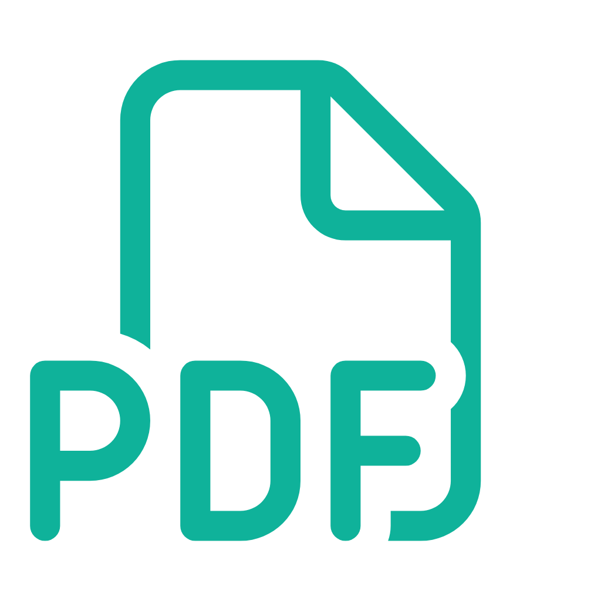
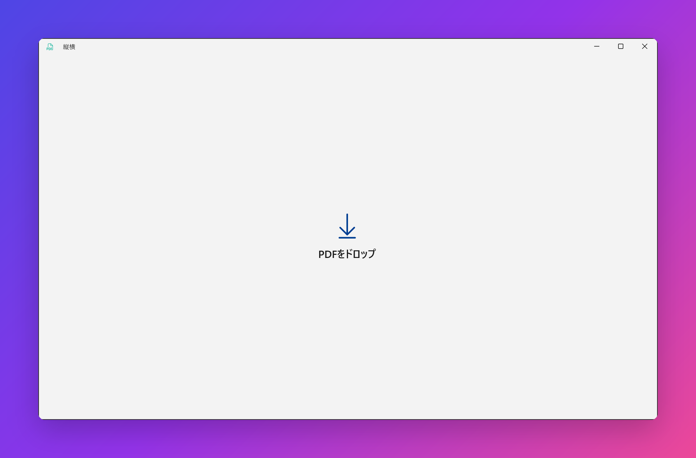

<div align="center">



# 縦横 &nbsp;·&nbsp; TateYoko

**縦書きの PDF を、2ページずつ右綴じ見開きに。**

Turn a vertical-writing (RTL) PDF into right-bound landscape spreads — so a wide screen reads like the real book.

[](https://github.com/P4suta/TateYoko/actions/workflows/ci.yml)
[](https://scorecard.dev/viewer/?uri=github.com/P4suta/TateYoko)
[](LICENSE)


<br />



</div>

---

## ✨ What it does

It takes a PDF of scanned **portrait** pages from a vertically written book and lays **two pages side by
side** on one landscape page. Reading order is **right-to-left**, so any PDF viewer's spread view shows
the pages in the correct order. One job, done well — comfortable reading on a wide screen.

```
   portrait pages  (read right → left)              right-bound spreads
   ┌───┐ ┌───┐ ┌───┐ ┌───┐ ┌───┐                    ┌───────┐ ┌───────┐
   │ 5 │ │ 4 │ │ 3 │ │ 2 │ │ 1 │      ────►         │ 2 │ 1 │ │ 4 │ 3 │  …
   └───┘ └───┘ └───┘ └───┘ └───┘                    └───────┘ └───────┘
                                                      page 1 lands on the right
```

<table>
<tr>
<td width="33%" valign="top">

### 🪶 Drop & go
Drop a PDF anywhere on the window (or pick a file). `<name>_spread.pdf` is written right next to it.

</td>
<td width="33%" valign="top">

### 📖 Right-bound
RTL pairing done properly — choose how the first page opens (from the right / cover alone / from the left).

</td>
<td width="33%" valign="top">

### 📦 Zero install
Unpackaged & self-contained. Copy the folder anywhere and run — the .NET / WinApp SDK runtimes are bundled.

</td>
</tr>
</table>

## 🚀 Usage

1. Launch the app and **drop a vertical-writing PDF anywhere on the window** (or click *Choose file*).
2. Choose how the first page opens (from the right / cover alone / from the left).
3. Click **Make spread**. `<name>_spread.pdf` is written next to the input.

## 📥 Download

Grab the latest signed `.zip` from [**Releases**](https://github.com/P4suta/TateYoko/releases), unzip anywhere, and double-click `TateYoko.exe`.

```
publish/win-x64/
├─ TateYoko.exe      ← double-click this (launcher)
├─ README.txt
├─ BUILDINFO.txt
└─ app/             ← the app and its runtime (do not touch)
```

The bundle root holds **only a launcher plus a README**; the app's ~350 files are confined to `app/`. The
root `TateYoko.exe` is a native (NativeAOT) launcher that starts `app/TateYoko.App.exe` and forwards its
arguments — so it's always obvious which exe to run.

## 🏗️ Architecture

A **hexagonal** design in four projects. Dependencies point inward — `Core` depends on neither PDF nor UI.

```
TateYoko.Core         Pure domain + use cases (PageDimension / Pagination /
                      SpreadLayoutCalculator / SpreadConversionService). No PDF/UI dependency.
TateYoko.Pdf          Infrastructure. Implements Core's ports with PDFsharp (the only layer that depends on PDF).
TateYoko.Presentation Presentation logic (MainViewModel state machine) over Core, behind small
                      abstractions (IUiDispatcher / IUiStrings / IShellLauncher). No WinUI dependency.
TateYoko.App          WinUI 3 (unpackaged) + composition root. Supplies the WinUI adapters for the
                      presentation abstractions. MVVM (CommunityToolkit.Mvvm) + DI.
```

The boundary is enforced at compile time: neither `Core` nor `Presentation` references PDFsharp or WinUI,
which keeps the domain and the view-model state machine unit-testable off the UI thread.

## 🛠️ Development

**mise** pins the toolchain (.NET 10 + [`just`](https://just.systems)); **just** is the single command
runner shared by local dev and CI. Run recipes under mise so they use the pinned SDK.

```sh
mise install                 # toolchain (.NET 10 + just)
mise exec -- just --list     # every recipe
mise exec -- just test       # all tests (Core unit + PDF integration + ViewModel state machine)
mise exec -- just run        # run in development (unpackaged)
mise exec -- just publish    # assemble the distribution bundle into publish/
mise exec -- just icons      # regenerate icon assets from assets/AppIcon.png
mise exec -- just ci         # what CI runs: format check + tests
```

With mise activated in your shell you can drop the prefix (`just test`). See [`justfile`](justfile) for the
full list. Release packaging is orchestrated by the C# tool `tools/TateYoko.Pack` (a thin `just publish`
wrapper) rather than a shell script; it also writes a zip and `SHA256SUMS.txt` to `publish/package/`.
Because the launcher is **NativeAOT**, building the bundle needs **Visual Studio C++ build tools** (MSVC
linker + Windows SDK): `winget install Microsoft.VisualStudio.2022.BuildTools`, then add *Desktop
development with C++*.

## 🔒 Releases & security

Versioning and releases are automated from [Conventional Commits](https://www.conventionalcommits.org/)
with release-please: merging its Release PR cuts a version, then CI builds a self-contained bundle,
Authenticode-signs the first-party binaries (SSL.com eSigner), attaches keyless build-provenance and a
CycloneDX SBOM, and publishes a signed `.zip` + `SHA256SUMS.txt`. See [docs/RELEASING.md](docs/RELEASING.md)
and [docs/SIGNING.md](docs/SIGNING.md). Report vulnerabilities privately per [SECURITY.md](.github/SECURITY.md).

Verify a download:

```sh
gh attestation verify TateYoko-vX.Y.Z-win-x64.zip --repo P4suta/TateYoko
sha256sum -c SHA256SUMS.txt
```

## 🧰 Tech stack

| Category | Technology |
|---|---|
| Language / runtime | C# / .NET 10 |
| UI | WinUI 3 (Windows App SDK) — unpackaged / self-contained |
| MVVM | CommunityToolkit.Mvvm |
| DI | Microsoft.Extensions.DependencyInjection |
| PDF | PDFsharp 6.x (MIT) |
| Tests | xUnit, NSubstitute (fakes), CsCheck (property-based invariants) |

## 📄 License

[Apache-2.0](LICENSE)
