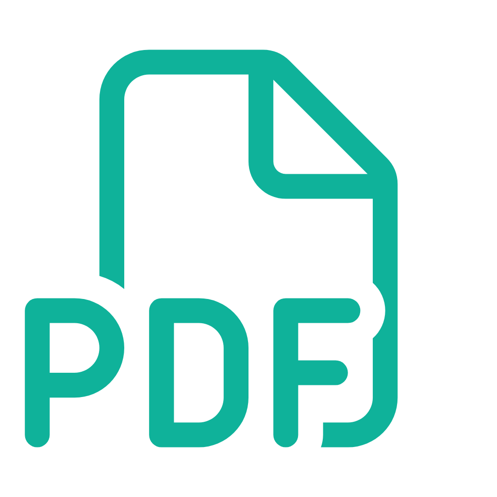

<div align="center">



# 縦横 · TateYoko

**縦書きPDFを、ワイド画面で自然に読める右綴じ見開きへ。**

[](https://github.com/P4suta/TateYoko/actions/workflows/ci.yml)
[](https://scorecard.dev/viewer/?uri=github.com/P4suta/TateYoko)
[](LICENSE)


</div>

## できること

縦書き本の1ページPDFを2ページずつ横に並べ、右から左へ読む見開きPDFを作ります。
ファイルをドロップし、最初のページの扱いを選び、変換するだけです。

```text
入力:  1, 2, 3, 4, 5
出力: [ 2 | 1 ] [ 4 | 3 ] [ 空白 | 5 ]
```

最初のページは次の3通りから選べます。

- 右から開始 — 1ページ目を最初の見開きの右へ配置
- 表紙を単独表示 — 1ページ目を単独の表紙として扱う
- 左から開始 — 右側を空白にして1ページ目を左へ配置

ページごとのサイズが異なるPDF、奇数ページ、パスワードで保護されたPDFにも対応します。
出力は入力と同じフォルダーの `<元名>_spread.pdf` です。既存ファイルは上書きせず、
必要なら番号付きの名前を原子的に確保します。

Webリンク、文書内リンク、名前付きリンク先、階層しおり、文書の言語と標準メタデータも
見開き上の位置へ合わせて保持します。フォーム、メモ、添付、スクリプト、タグ付き構造、
レイヤー、独自XMPなどを完全に保持できないPDFは、欠落した出力を作らず変換前に停止します。

## インストール

対応環境はWindows 11のx64とARM64です。

推奨は[Releases](https://github.com/P4suta/TateYoko/releases)にある
`TateYoko.appinstaller`です。署名済みMSIX bundleをインストールし、公開済みの最新版を
自動確認します。MSIXとportable版はどちらも.NETとWindows App SDKを内包するため、
別のランタイムを事前インストールする必要はありません。インストールせず使う場合は、
CPUに合うZIPを展開し、`TateYoko.exe`と`TateYoko.pri`を同じフォルダーに置いたまま
起動します。

- `TateYoko-win-x64.zip`
- `TateYoko-win-arm64.zip`

すべての公開実行コードはAuthenticode署名とRFC 3161タイムスタンプを必須とし、ZIPを
含む全公開物へチェックサム、CycloneDX SBOM、第三者ライセンス、GitHub artifact
attestationを付けます。署名できないビルドは公開されません。

```powershell
gh attestation verify TateYoko.msixbundle --repo P4suta/TateYoko
Get-FileHash TateYoko.msixbundle -Algorithm SHA256
Get-AuthenticodeSignature TateYoko.msixbundle
```

## プライバシーと公開範囲

変換は端末内だけで完結します。テレメトリ、更新確認を含むアプリ独自のネットワーク通信、
広告、アカウント、クラウド保存はありません。AppInstallerによる更新確認はWindowsの
配布機構が行います。

PDFはユーザーが画面で1ファイルずつ選択します。ファイル関連付け、プロトコル、Explorer
メニュー、コマンドライン入力は公開していません。暗号化PDFのパスワードは必要な変換中
だけメモリに保持し、設定やログへ保存しません。診断ログにはファイルパスやPDF内容を
書きません。

## 設計

公開APIは小さな`TateYoko.Engine`だけです。`TateYoko.App`はWinUI 3の状態機械とOS連携を
担当し、PDFsharpはEngine内部へ閉じています。

```text
TateYoko.App  ──>  TateYoko.Engine  ──>  PDFsharp
      │                    │
  WinUI/MVVM          公開変換契約
```

変換処理は全ページをメモリへ載せずに順次処理し、同じフォルダーの一時ファイルへ書いた後、
再オープン検証に成功した場合だけ出力名へ確定します。キャンセル・例外・プロセス競合でも
既存出力を壊さないことをテストしています。

## 開発

`.NET 10.0.302`、`just`、補助ツールはすべてバージョン固定です。

```powershell
mise install
mise exec -- just restore          # 初回/依存更新時。lock fileも更新
mise exec -- just ci               # CIと同じ全ゲート
mise exec -- just run              # Developer Modeが必要
mise exec -- just dist-build 0.1.0
```

実UIのRC確認は`just run`で表示されたPIDを
`mise exec -- just ui-test <PID>`へ渡します。キーボード、Windowsピッカー、主要状態、
アクセシビリティIDを一括検査し、状態別PNGとJSON結果を`build/ui-tests/`へ保存します。

`just ci`はlocked restore、format、全警告エラーのbuild、テスト、line/branch coverage、
NuGet監査、法務notice生成、mutation testingを実行します。PDFレイアウトはPopplerで
レンダリングしたピクセル結果でも検証し、1000ページの時間・メモリ予算も固定しています。

詳しくは[CONTRIBUTING.md](CONTRIBUTING.md)、リリース手順は
[docs/RELEASING.md](docs/RELEASING.md)を参照してください。

## License

TateYokoは[Apache-2.0](LICENSE)です。配布物に正確な
`THIRD-PARTY-NOTICES.txt`を同梱します。
